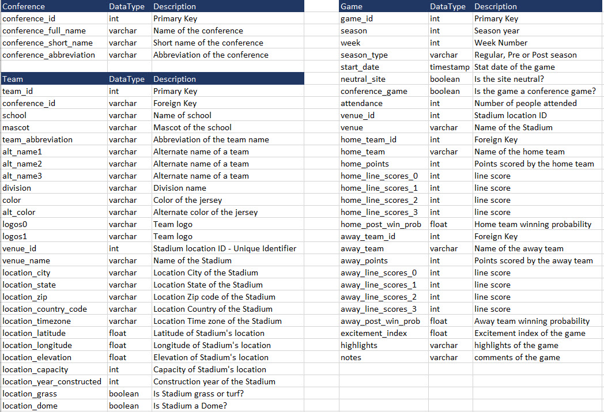
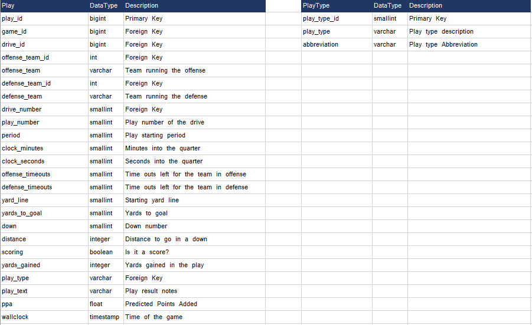

# Rise of LSU

### Project Summary
As a passionate football football and a big fan of LSU football, I wanted to anlayze how LSU was able to built a championship team in just one year during the 2019 season. On a higher level I knew the offense was completely transformed from a run heavy to a pass heavy offense. However I wanted to gather the data since 2012 and deep dive into the data to analyze/compare the seasons and what all have changed over the years.

### Scope of the Project
The objective of this project is to collect College Football data for the past decade for analysis for my data engineering project. Once the data is gathered, I will be using Microsoft excel tool to clean up the data and copy them over as individual files in AWS S3 buckets. I will develop an ETL process using Airflow and Python to perform staging of source data, loading of Facts and Dimension tables, and perform Data Quality checks. I will run queries off the snowflake schema to do analysis. I will be focussing on the LSU Team on how they built a championship team in 2019 by comparing the data over a decade.

#### Data Description
I am using the data exported from ESPN and other open sources available online. The data contains granular information starting from the conference details till the play by play details of each game and their results.

###### Data Sources 
- https://collegefootballdata.com/exporter
- https://drive.google.com/drive/folders/0B13YvT1olZIfZ0NKaEZDdGt3TDQ?resourcekey=0-sh9lds-ck95y3yeBpClk7g

#### Explore the Data 
Identify data quality issues, like missing values, duplicate data, etc.

#### Cleaning Steps
- Fixed the date time stamp column in the files to have a timestamp in the format YYYY-MM-DD HH:MM:SS
- Cleaned up special characters that PostgreSQL does not support during insertion of data into the tables. For ex: San José State has a diacritical mark on the letter e in the word "Jose". PostgreSQL fails during insert of data into the tables. So I have replaced words like "José" to 'Jose' by removing the diacritical mark.

     
     
     
     
     
