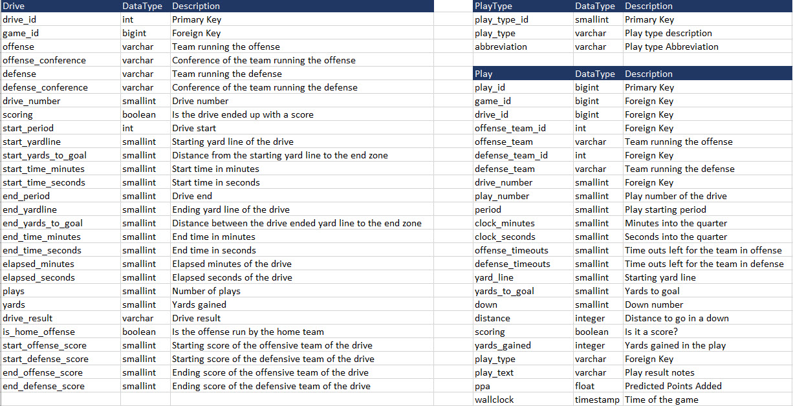

# Rise of LSU

### Project Summary
As a passionate football follower and a big fan of LSU football, I wanted to anlayze how LSU was able to built a championship team in just one year during the 2019 season. On a higher level I knew the offense was completely transformed from a run heavy to a pass heavy offense. However I wanted to gather the data since 2012 and deep dive into the data to analyze/compare the seasons and what all have changed over the years.

### Scope of the Project
The objective of this project is to collect College Football data for the past decade for analysis for my data engineering project. Once the data is gathered, I will be using Microsoft excel tool to clean up the data and copy them over as individual files in AWS S3 buckets. I will develop an ETL process using Airflow and Python to perform staging of source data, loading of Facts and Dimension tables, and perform Data Quality checks. I will run queries off the snowflake schema to do analysis. I will be focussing on the LSU Team on how they built a championship team in 2019 by comparing the data over a decade.

###  Explore and Assess the Data
I am using the data exported from ESPN and other open sources available online. The data contains granular information starting from the conference details till the play by play details of each game and their results.

### Data Cleansing
- Fixed the date time stamp column in the files to have a timestamp in the format YYYY-MM-DD HH:MM:SS
- Cleaned up special characters that PostgreSQL does not support during insertion of data into the tables. For ex: San José State has a diacritical mark on the letter e in the word "Jose". PostgreSQL fails during insert of data into the tables. So I have replaced words like "José" to 'Jose' by removing the diacritical mark.

###### Sources 
- https://collegefootballdata.com/exporter
- https://drive.google.com/drive/folders/0B13YvT1olZIfZ0NKaEZDdGt3TDQ?resourcekey=0-sh9lds-ck95y3yeBpClk7g

### Staging Data Model

### Snowflake Schema Data Model

### Data Dictionary

### Data Pipelines

#### Choice of tools
I used the following tools to complete my project 
- Apache Airflow
- Python
- Apache Spark
- Jupyter Notebook
- PostgresSQL
- Amazon Redshift
- AWS
- dbdiagram

#### why I chose the above tools?

- Apache Airflow: 
Apache Airflow is an open-source tool to programmatically author, schedule, and monitor workflows. It is one of the most robust platforms used by Data Engineers for orchestrating workflows or pipelines. We can easily visualize our data pipelines' dependencies, progress, logs, code, trigger tasks, and success status.

- Python: As Industries are moving towards moved Big data, Machine Learning and Cloud Computing, Python has become the first choice language due to the main reason for python being in high demand in the development market. It is widely used because it is easy to learn and also for it's versatility, efficiency, reliability, and speed. It helps with ease of analyzing and organizing the usable data.

- Apache Spark: Apache Spark is helpful for data engineers to build fast and more reliable data pipelines. It is an open-source, distributed processing system used for big data workloads. It utilizes in-memory caching, and optimized query execution for fast analytic queries against data of any size. It provides development APIs in Java, Scala, Python and R, and supports code reuse across multiple workloads—batch processing, interactive queries, real-time analytics, machine learning, and graph processing. 

- Jupyter Notebook: Used Jupyter notebook to execute scripts and check syntax. It gives flexibility to run individual blocks of scripts of ETL without having to run the whole ETL pipeline. 

- Amazon Redshift: Redshift has the ability to handle huge volumes of data and capable of processing structured and unstructured data in the range of exabytes (1018 bytes). I have great learning during the course and I was able to apply my knowledge in this project.

- PostgreSQL: Since PostgreSQL supports both SQL (relational) and JSON (non-relational) querying, I preferred PostgresSQL over other tools as it is alos highly stable and used across many web applications across industries

- AWS: Since AWS and GCP are the leaders of cloud computing, I preferred to pick AWS as it is gives easier learning experience for beginners compatred to GCP.

- dbdiagram: Used dbdiagram tool to create the data model. This tool has the import feature to create the diagram by directly importing the Postgres SQL scripts. This tools provides users with a seamless process in creating data model diagrams.

### Scope for future Improvements
- The dataset can be manipilated for different metrics. One good data field is the play text whih contains the description of the plays. We can use this data for text analytics.
- Also, we can gather data of player information and their drafting metrics.

## Conclusion

- The complete set of data was cleaned up and loaded into the schema tables through ETL pipelines. Using the tables I was able to query data to analyze LSU's performance over the seasons. I have included a couple of queries and there are more analysis that can be done using the data.
